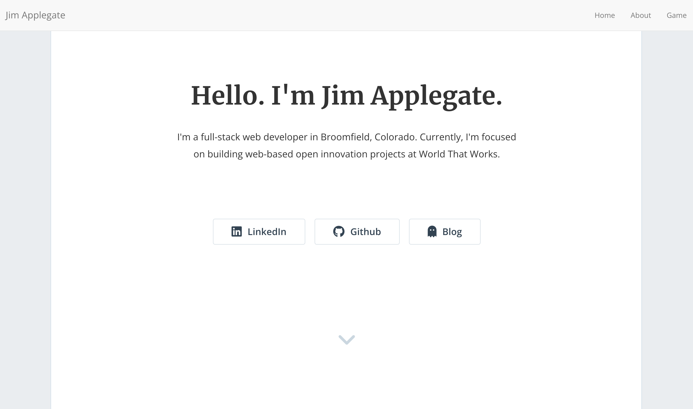

# Jim Applegate's Portfolio

This is an older version of my portfolio website, based on the [Phantom Jekyll Theme](https://jekyllthemes.io/theme/phantom) by Jami Gibbs. I started with her theme and tweaked it quite a bit (as we developers tend to do) for my own needs.

I've since replaced this version of the site with a [version I built in Gatsby](https://github.com/jimappleg8/my-gatsby-portfolio). The new site is hosted on Netlify at [https://jimappleg8.com/](https://jimappleg8.com/).

The site was set up to use Webpack and React components using an [excelent guide](https://medium.com/@allizadrozny/using-webpack-and-react-with-jekyll-cfe137f8a2cc) by Alli Zadrozny. I found this setup fun to use, but the components that I built were slow to load and the experiences wasn't great. That's part of the reason I moved it to Gatsby. Gatsby is designed around React components and the experience is cleaner.

## Screenshot

